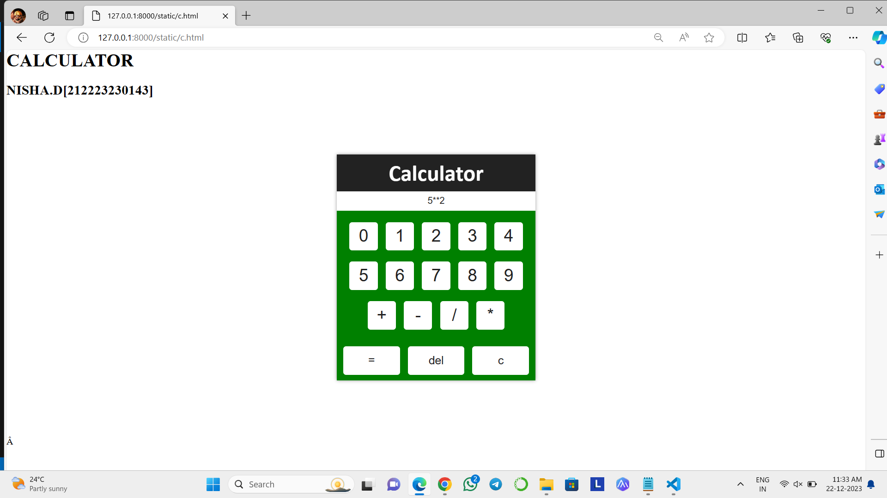

# Ex.08 Design of a Standard Calculator
## Date:21/12/2023

## AIM:
To design a web application for a standard calculator with minimum five operations.

## DESIGN STEPS:

### Step 1:
Clone the github repository and create Django admin interface.

### Step 2:
Change settings.py file to allow request from all hosts.

### Step 3:
Use CSS for creating attractive colors.

### Step 4:
Write JavaScript program for implementing five different operations.

### Step 5:
Validate the HTML and CSS code.

### Step 6:
Publish the website in the given URL.

## PROGRAM :
```

<html>
  <body>
<h1>CALCULATOR</h1>
<h2>NISHA.D[212223230143]</h2>
    <style>
      body {
        padding: 0;
        margin: 0;
        background: white;
      }
      
      .cont {
        position: relative;
        width: 100%;
        padding: 0;
        margin: 0;
        text-align: center;
      }
      
      .calsi {
        width: 350px;
        padding: 0;
        margin: 100px auto;
        text-align: center;
        background:green;
        box-shadow: 0px 0px 6px 0px #0006;
      }
      
      .calsi h1 {
        font-size: 40px;
        font-family: calibri;
        font-weight: bold;
        color: white;
        text-transform: capitalize; /* Corrected typo here */
        padding: 8px 0px;
        text-align: center;
        width: 100%;
        background: #222;
        margin: 0 auto;
      }
      
      #inp {
        position: relative;
        width: 100%;
        padding: 8px 0px;
        text-align: center;
        font-size: 16px;
        font-family: arial;
        font-weight: normal;
        color: #222;
        outline: none;
        border: none;
        background: white;
      }
      
      .btns {
        position: relative;
        width: 100%;
        padding: 10px 0px;
      }
      
      .btns button {
        border: none;
        outline: none;
        width: 50px;
        height: 50px;
        font-size: 30px;
        color: #222;
        vertical-align: middle;
        border-radius: 5px;
        background: white;
        margin: 10px 5px;
        display: inline-block;
      }
      
      button {
        border: none;
        outline: none;
        width: 100px;
        height: 50px;
        font-size: 20px;
        color: #222;
        border-radius: 5px;
        vertical-align: middle;
        background: white;
        margin: 10px 5px;
        display: inline-block;
      }
    </style>
    <div class="cont">
      <div class="calsi">
        <h1>Calculator</h1>
        <input type="text" id="inp" placeholder="Enter Value..." readonly="">
        <div class="btns">
          <button onclick="AT_add(1)">0</button>
          <button onclick="AT_add(1)">1</button>
          <button onclick="AT_add(2)">2</button>
          <button onclick="AT_add(3)">3</button>
          <button onclick="AT_add(4)">4</button>
          <button onclick="AT_add(5)">5</button>
          <button onclick="AT_add(6)">6</button>
          <button onclick="AT_add(7)">7</button>
          <button onclick="AT_add(8)">8</button>
          <button onclick="AT_add(9)">9</button>
          <button onclick="AT_add('+')">+</button>
          <button onclick="AT_add('-')">-</button>
          <button onclick="AT_add('/')">/</button>
          <button onclick="AT_add('*')">*</button>
        </div>
        <button onclick="exe()">=</button>
        <button onclick="cancel()">del</button>
        <button onclick="cls()">c</button>
      </div>
    </div>
    <script>
      var val = document.getElementById("inp");

      function AT_add(v) {
        val.value += v;
      }

      function cls() {
        val.value = "";
      }

      function exe() {
        val.value = eval(val.value);
      }

      function cancel() {
        val.value = val.value.substr(0, val.value.length - 1);
      }
    </script>
  </body>
</html>

```
## OUTPUT:




## RESULT:
The program for designing a standard calculator using HTML and CSS is executed successfully.
